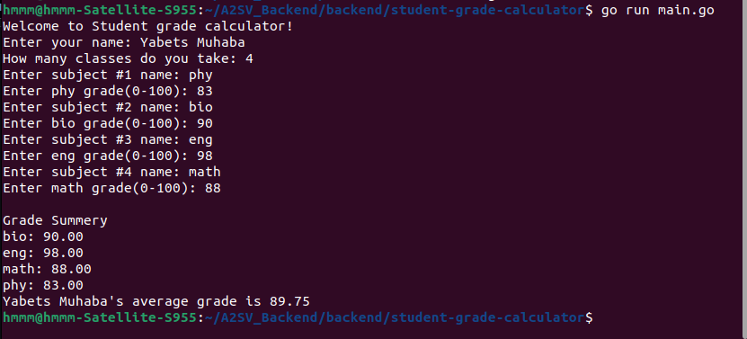

# Student Grade Calculator

## Overview

The **Student Grade Calculator** is a Go console application that allows students to calculate their average grade based on different subjects. The application prompts the user to enter their name, the number of subjects they have taken, and the grades they received in each subject. After inputting all required data, the program displays a summary of the individual grades along with the calculated average grade.

## Features

- Accepts student name input.
- Allows users to enter multiple subjects and their corresponding grades.
- Validates grade inputs to ensure they are within a valid range (0-100).
- Calculates and displays the average grade.
- Provides a clear and structured output of the student’s grades and average.

## Prerequisites

To run this program, ensure you have the following installed:

- Go (Golang) installed on your system
- A terminal or command-line interface

## Installation & Usage

1. Clone this repository or create a Go file with the provided code.
2. Open a terminal and navigate to the directory containing the `student-grade-calculator.go` file.
3. Compile and run the program using the following command:
   ```sh
   go run student-grade-calculator.go
   ```
4. Follow the on-screen prompts to enter your details and calculate your average grade.

## Example Usage

```
Welcome to Student grade calculator!
Enter your name: Yabets Muhaba
How many classes do you take: 3
Enter subject #1 name: Math
Enter Math grade(0-100): 90
Enter subject #2 name: Science
Enter Science grade(0-100): 85
Enter subject #3 name: History
Enter History grade(0-100): 88

Grade Summary
Math: 90.00
Science: 85.00
History: 88.00
John Doe's average grade is 87.67
```

## Example running Image 



## Code Structure

- `main()`: Handles user input and manages the flow of the program.
- `average(grades map[string]float64) float64`: Computes and returns the average grade.

## Contributions

If you’d like to contribute to this project, feel free to fork the repository, make your changes, and submit a pull request.

---

peace out! 
